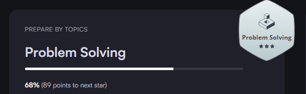
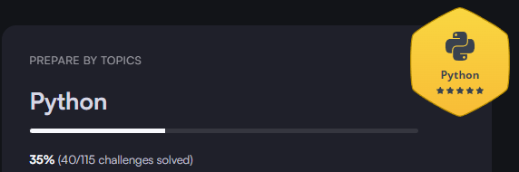
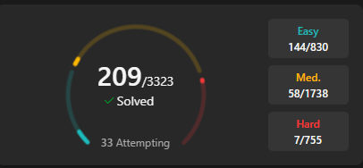

# Hi there! 👋 I'm Shashwat Pal

I'm a **Full Stack Developer** based in India. I have a passion for building efficient, scalable applications and infrastructure. My expertise spans a wide range of technologies and tools.

## 🔭 Currently Working On

I am currently working at HTS Tech Solution as Software Backend Developer and focused on developing full-stack applications and enhancing my DevOps skills. 

## 🌐 Tech Stack

### 💻 Languages
&nbsp;&nbsp;
&nbsp;&nbsp;
&nbsp;&nbsp;
&nbsp;&nbsp;

### 🌍 Web Development
&nbsp;&nbsp;
&nbsp;&nbsp;
&nbsp;&nbsp;
&nbsp;&nbsp;
&nbsp;&nbsp;
&nbsp;&nbsp;
&nbsp;&nbsp;
&nbsp;&nbsp;
&nbsp;&nbsp;
&nbsp;&nbsp;
&nbsp;&nbsp;
&nbsp;&nbsp;
&nbsp;&nbsp;
&nbsp;&nbsp;

### ⚙️ DevOps
&nbsp;&nbsp;
&nbsp;&nbsp;
&nbsp;&nbsp;
&nbsp;&nbsp;
&nbsp;&nbsp;
&nbsp;&nbsp;
&nbsp;&nbsp;

## 🚀 Projects

### [Rentify_App](https://rentify-app-ten.vercel.app/)
- Developed an interactive Rentify website where users and sellers can take and rent properties.
- Used NextAuth for authentication and authorization.
- Tech Stack: Next.js, TailwindCSS, MongoDB.
- Users can view properties based on rates, descriptions, and amenities, and contact property managers.
- Filter options available based on location and property type.

### [Issue Tracker](https://issue-tracker-umber-delta.vercel.app/)
- Developed an interactive issue tracker app using Next.js, React.js, TailwindCSS, NextAuth, Prisma (ORM), and PostgreSQL.
- Implemented authentication and authorization using NextAuth.
- Users can create issues, assign them, and filter based on status, creator, etc.
- Visual representation of issues using bar graphs.

### Alphabet Gaming App 
- Developed an interactive Alphabet Gaming App using React.js, HTML, CSS, and JavaScript.
- Enabled users to participate in alphabet-based games through a keyboard interface.
- Presented 20 random alphabets one at a time, challenging users to input the correct letter.
- Implemented a 0.5-second penalty for incorrect entries.
- Assessed user performance based on high scores and provided feedback if they didn't achieve a high score.
- Showcased expertise in front-end development, responsive design, and gamification.

### Thyroid Prediction System Using Machine Leaning
- Developed a user-friendly front-end application for patients to assess their thyroid status.
- Utilized HTML, Python, Flask, and Heroku to create the platform.
- Analyzed patient data and employed machine learning, specifically a Random Forest classification model, to provide
predictive insights.
- Implemented features allowing patients to input basic information and test results for self- assessment.
- Ensured adherence to industry-specific healthcare and data privacy standards.
- Showcased expertise in machine learning and web application development, contributed to improved healthcare accessibility and
early diagnosis.

## 📫 Connect with Me

&nbsp;&nbsp;
&nbsp;&nbsp;
&nbsp;&nbsp;

Feel free to reach out for collaboration or just to connect!

### Coding profiles ...
&nbsp;&nbsp;
&nbsp;&nbsp;

##

